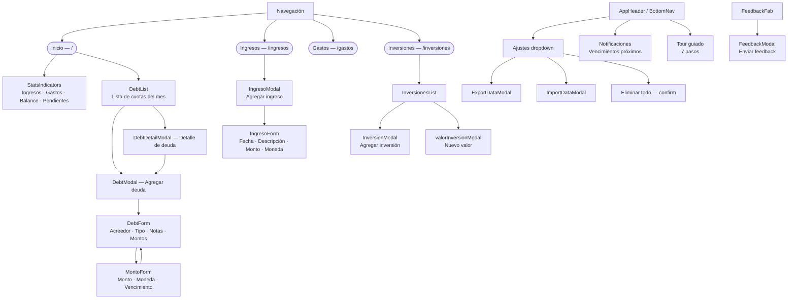

# 02 — Relevamiento de lo hecho (Inventario baseline de microcopy)

> **Objetivo:** inventariar todos los textos visibles al usuario en la app actual.  
> **Fuente de verdad:** código fuente del repo `rochafederico/deudas-app` (estado relevado: abril 2026).  
> **Links:** [← Home](https://github.com/rochafederico/deudas-app/wiki) | [03 →](https://github.com/rochafederico/deudas-app/wiki/03-Manual-UI-Copy-Guidelines)

---

## 🗺️ Mapa de flujos (Mermaid)

---

## 📋 Inventario de textos (baseline)

### Shell / Navegación

| Pantalla/Flow | Componente | Tipo | Texto actual | Observación |
|---|---|---|---|---|
| Header | AppHeader | Marca | `Nivva` | ✅ Correcto |
| Header | AppHeader — Ajustes | Nav item | `Ajustes` | ✅ Correcto |
| Header | AppHeader — Ajustes | Dropdown item | `Exportar datos` | ✅ Correcto |
| Header | AppHeader — Ajustes | Dropdown item | `Importar datos` | ✅ Correcto |
| Header | AppHeader — Ajustes | Dropdown item danger | `Eliminar todo` | ⚠️ Ambiguo — no aclara qué se elimina |
| Header | AppHeader | Button title | `Vencimientos próximos` | ✅ Correcto |
| Header | AppHeader | Button aria-label | `Ver vencimientos próximos` | ✅ Correcto |
| Header | AppHeader | Button title | `Abrir guía rápida` | ✅ Correcto |
| Header | AppHeader — Notificaciones | Popover title | `⚠️ Vencimientos próximos` | ✅ Correcto |
| Nav | navConfig | Page title | `Panorama financiero` | ✅ Correcto |
| Nav | navConfig | Page title | `Ingresos del mes` | ✅ Correcto |
| Nav | navConfig | Page title | `Gastos del mes` | ✅ Correcto |
| Nav | navConfig | Page title | `Seguimiento de inversiones` | ✅ Correcto |
| Nav | navConfig | Subtitle | `Gestioná y visualizá la información del período seleccionado.` | ✅ Correcto (vos) |
| Nav | navConfig | Nav label | `Inicio` | ✅ |
| Nav | navConfig | Nav label | `Ingresos` | ✅ |
| Nav | navConfig | Nav label | `Gastos` | ✅ |
| Nav | navConfig | Nav label | `Inversiones` | ✅ |

### Egresos / DebtList

| Pantalla/Flow | Componente | Tipo | Texto actual | Observación |
|---|---|---|---|---|
| Egresos | DebtList | Empty state | `No hay datos.` | ⚠️ Muy genérico — falta contexto y próximo paso |
| Egresos | DebtList | Table header | `Monto` | ✅ |
| Egresos | DebtList | Table header | `Moneda` | ✅ |
| Egresos | DebtList | Table header | `Vencimiento` | ✅ |
| Egresos | DebtList | Table header | `Acciones` | ✅ |

### DebtModal / DebtForm

| Pantalla/Flow | Componente | Tipo | Texto actual | Observación |
|---|---|---|---|---|
| Modal alta | DebtModal | Title | `Agregar deuda` | ✅ |
| Modal edición | DebtModal | Title | `Editar deuda` | ✅ |
| Formulario | DebtForm | Label | `Acreedor` | ✅ |
| Formulario | DebtForm | Label | `Tipo de Deuda` | ⚠️ Inconsistente: mayúscula en "Deuda" vs detalle que usa "Tipo de deuda" |
| Formulario | DebtForm | Label | `Notas` | ✅ |
| Formulario | DebtForm | Section | `Montos` | ✅ |
| Formulario | DebtForm | Button | `Agregar monto` | ✅ |
| Formulario | DebtForm | Button title | `Guardar` (monto) | ✅ |
| Formulario | DebtForm | Button title | `Cancelar` (monto) | ✅ |
| Formulario | DebtForm | Button title | `Editar` (monto) | ✅ |
| Formulario | DebtForm | Button title | `Eliminar` (monto) | ✅ |
| Formulario | DebtForm | Button title | `Duplicar` (monto) | ✅ |
| Formulario | DebtForm | Checkbox title | `Marcar como pagado` | ✅ |
| Formulario | DebtForm | Error message | `Debe agregar al menos un monto antes de guardar.` | ✅ Claro, pero falta próximo paso explícito |
| Modal footer | DebtModal | Button | `Cancelar` | ✅ |
| Modal footer | DebtModal | Button | `Guardar` | ✅ |

### DebtDetailModal

| Pantalla/Flow | Componente | Tipo | Texto actual | Observación |
|---|---|---|---|---|
| Detalle | DebtDetailModal | Title | `Detalle de deuda` | ✅ |
| Detalle | DebtDetailModal | Label | `Total pendiente` | ✅ |
| Detalle | DebtDetailModal | Label row | `Acreedor` | ✅ |
| Detalle | DebtDetailModal | Label row | `Tipo de deuda` | ✅ (minúscula — correcto) |
| Detalle | DebtDetailModal | Label row | `Moneda` | ✅ |
| Detalle | DebtDetailModal | Label row | `Próximo vencimiento` | ✅ |
| Detalle | DebtDetailModal | Label row | `Notas` | ✅ |
| Detalle | DebtDetailModal | Section header | `Montos` | ✅ |
| Detalle | DebtDetailModal | Button | `Editar` | ✅ |
| Detalle | DebtDetailModal | Button | `Cerrar` | ✅ |

### Ingresos

| Pantalla/Flow | Componente | Tipo | Texto actual | Observación |
|---|---|---|---|---|
| Modal | IngresoModal | Title | `Agregar ingreso` | ✅ |
| Formulario | IngresoForm | Label | `Fecha` | ✅ |
| Formulario | IngresoForm | Label | `Descripción` | ✅ |
| Formulario | IngresoForm | Label | `Monto` | ✅ |
| Formulario | IngresoForm | Label | `Moneda` | ✅ |
| Formulario | IngresoForm | Submit | `Agregar ingreso` | ✅ |
| Formulario | IngresoForm | Cancel | `Cancelar` | ✅ |

### Inversiones

| Pantalla/Flow | Componente | Tipo | Texto actual | Observación |
|---|---|---|---|---|
| Lista | InversionesList | Button | `Agregar inversión` | ✅ |
| Lista | InversionesList | Button | `Nuevo valor` | ✅ |
| Lista | InversionesList | Button | `Eliminar` | ✅ |
| Lista | InversionesList | Label | `Total invertido:` | ⚠️ Falta dos puntos al final de otros labels para consistencia |
| Modal alta | InversionModal | Label | `Nombre` | ✅ |
| Modal alta | InversionModal | Label | `Valor Inicial` | ⚠️ Mayúscula inconsistente — debería ser "Valor inicial" |
| Modal alta | InversionModal | Label | `Moneda` | ✅ |
| Modal alta | InversionModal | Label | `Fecha Compra` | ⚠️ "Fecha Compra" → debería ser "Fecha de compra" |
| Modal alta | InversionModal | Submit | `Guardar` | ✅ |
| Modal alta | InversionModal | Cancel | `Cancelar` | ✅ |

### Import / Export

| Pantalla/Flow | Componente | Tipo | Texto actual | Observación |
|---|---|---|---|---|
| Exportar | ExportDataModal | Toast success | `✅ Exportación exitosa. El archivo se descargó.` | ✅ |
| Exportar | ExportDataModal | Toast error | `❌ Error al exportar los datos` | ⚠️ Falta próximo paso |
| Importar | ImportDataModal | Instrucción | `📁 Selecciona un archivo JSON de backup para importar` | ❌ Usa "tú" implícito (`Selecciona`) — debe ser "Seleccioná" |
| Importar | ImportDataModal | Button | `Seleccionar archivo` | ⚠️ Infinitivo genérico — ok como fallback |
| Importar | ImportDataModal | Warning | `⚠️ Importante:` | ✅ |
| Importar | ImportDataModal | Info | `Añade datos sin borrar los existentes.` | ❌ "Añade" es tuteo — debe ser "Añade" → "Agrega" (vos) o reescribir |
| Importar | ImportDataModal | Info | `Fusión automática: mismo Acreedor + Tipo de Deuda → los montos se agrupan.` | ⚠️ Técnico, pero aceptable en contexto de importación |
| Importar | ImportDataModal | Info | `Duplicados ignorados si coinciden monto, moneda y periodo.` | ⚠️ Técnico — ok en este contexto |
| Importar | ImportDataModal | Button | `📥 Importar datos` | ✅ |
| Importar | ImportDataModal | Button | `Cancelar` | ✅ |
| Importar | ImportDataModal | Error | `❌ Archivo JSON no válido. Asegúrate de que sea un backup de DeudasApp.` | ❌ "Asegúrate" es tuteo — debe ser "Asegurate" |
| Importar | ImportDataModal | Error | `❌ Error al leer el archivo. Asegúrate de que sea un JSON válido.` | ❌ "Asegúrate" es tuteo — debe ser "Asegurate" |
| Importar | ImportDataModal | Error | `❌ No hay datos para importar` | ✅ |
| Importar | ImportDataModal | Error | `❌ Error durante la importación` | ⚠️ Falta próximo paso |
| Importar | ImportDataModal | Loading | `Importando datos...` | ✅ |
| Importar | ImportDataModal | Loading | `Importando ingresos...` | ✅ |
| Importar | ImportDataModal | Loading | `Importando inversiones...` | ✅ |
| Importar | ImportDataModal | Toast success | `✅ Importación exitosa: N deudas, N ingresos, N inversiones` | ✅ |
| Importar | ImportDataModal | Toast warning | `⚠️ Importación parcial: ...` | ✅ |

### Eliminar todos los datos

| Pantalla/Flow | Componente | Tipo | Texto actual | Observación |
|---|---|---|---|---|
| Confirmación | dataActions | confirm() | `¿Estás seguro de que deseas eliminar todos los datos? Esta acción no se puede deshacer.` | ⚠️ "Estás" es tuteo implícito via `confirm()` nativo — evaluar reemplazo por modal propio |
| Toast error | dataActions | Toast danger | `❌ Error al cargar los módulos de datos.` | ❌ Técnico — "módulos de datos" no es lenguaje de usuario |
| Toast warning | dataActions | Toast warning | `⚠️ No había datos para borrar.` | ✅ |
| Toast success | dataActions | Toast success | `✅ Eliminado: ...` | ✅ |
| Toast info | dataActions | Toast info | `ℹ️ Sin registros: ...` | ✅ |
| Toast error | dataActions | Toast error | `❌ Error al eliminar: ...` | ⚠️ Falta próximo paso |

### Feedback

| Pantalla/Flow | Componente | Tipo | Texto actual | Observación |
|---|---|---|---|---|
| Modal | FeedbackModal | Title | `Enviar feedback` | ⚠️ "feedback" en inglés — evaluar "Enviar comentario" |
| Modal | FeedbackModal | Label | `Tipo` | ✅ |
| Modal | FeedbackModal | Placeholder select | `Seleccioná un tipo…` | ✅ (vos) |
| Modal | FeedbackModal | Option | `💡 Sugerencia` | ✅ |
| Modal | FeedbackModal | Option | `🐛 Problema` | ✅ |
| Modal | FeedbackModal | Option | `❓ Confusión` | ✅ |
| Modal | FeedbackModal | Label | `Comentario` | ✅ |
| Modal | FeedbackModal | Placeholder | `Describí tu sugerencia, problema o confusión…` | ✅ (vos) |
| Modal | FeedbackModal | Tip | `💡 Si tenés imagen o video, adjuntalo luego en la plataforma.` | ✅ (vos) |
| Modal | FeedbackModal | Warning | `⚠️ Evitá incluir datos sensibles como montos u otros datos personales.` | ✅ (vos) |
| Modal | FeedbackModal | Button | `Enviar` | ✅ |

### StatsIndicators

| Pantalla/Flow | Componente | Tipo | Texto actual | Observación |
|---|---|---|---|---|
| Dashboard | StatsIndicators | Loading | `Cargando resumen...` | ✅ |
| Dashboard | StatsIndicators | Error | `Error cargando resumen` | ⚠️ Muy genérico, falta próximo paso |
| Dashboard | StatsCard | Title | `Ingresos` | ✅ |
| Dashboard | StatsCard | Title | `Gastos` | ✅ |
| Dashboard | StatsCard | Title | `Balance` | ✅ |
| Dashboard | StatsCard | Title | `Pendientes` | ✅ |

### Tour guiado (7 pasos)

| # | ID | Título actual | Texto actual | Observación |
|---|---|---|---|---|
| 1 | bienvenida | `Bienvenida` | `Organizá tus deudas y gastos fijos en un solo lugar` | ✅ (vos) |
| 2 | indicadores | `Indicadores` | `Acá vas a ver tu resumen mensual de un vistazo` | ⚠️ "tu" — en vos se puede mantener posesivo, pero "Acá" es muy coloquial — ok |
| 3 | navegacion-mes | `Navegación por mes` | `Navegá entre meses para ver tus pagos pasados y futuros` | ✅ (vos) |
| 4 | nueva-deuda | `Nueva deuda` | `Cargá tus deudas: tarjeta, alquiler, préstamos, servicios` | ✅ (vos) |
| 5 | datos-backup | `Exportar e importar datos` | `Desde Ajustes podés hacer un backup de tu información o restaurarla desde un archivo JSON` | ⚠️ "backup" en inglés — evaluar "copia de seguridad"; "archivo JSON" técnico |
| 6 | menu-navegacion | `Menú de navegación` | `Explorá las distintas secciones desde acá` | ✅ (vos) |
| 7 | privacidad | `Privacidad` | `Tus datos se guardan solo en tu navegador. Nunca se envían a ningún servidor.` | ✅ |

### Notificaciones de vencimiento

| Pantalla/Flow | Componente | Tipo | Texto actual | Observación |
|---|---|---|---|---|
| Notificación nativa | NotificationService | Title | `Pagos vencidos o por vencer` | ✅ |
| Panel vencimientos | paymentNotificationUI | Relative date | `hoy`, `mañana`, `ayer` | ✅ |
| Panel vencimientos | paymentNotificationUI | Relative date | `hace N días` / `en N días` | ✅ |
| Panel vencimientos | paymentNotificationUI | Verb | `Venció` / `Vence` | ✅ |

---

## 🔴 Problemas detectados (resumen)

| ID | Gravedad | Problema | Componente | Propuesta |
|---|---|---|---|---|
| P-01 | 🔴 Alta | "Asegúrate" en vez de "Asegurate" (tuteo) | ImportDataModal | Corregir a "Asegurate" |
| P-02 | 🔴 Alta | "Selecciona" en vez de "Seleccioná" (tuteo) | ImportDataModal | Corregir a "Seleccioná" |
| P-03 | 🔴 Alta | "Añade" en vez de "Agregá" (tuteo) | ImportDataModal | Corregir a "Agregá" |
| P-04 | 🟡 Media | "Error al cargar los módulos de datos" (técnico) | dataActions | "No pudimos eliminar tus datos. Intentá de nuevo." |
| P-05 | 🟡 Media | "No hay datos." sin contexto ni próximo paso | DebtList | "Todavía no cargaste ningún egreso. ¡Agregá tu primera deuda!" |
| P-06 | 🟡 Media | "Tipo de Deuda" (inconsistente con "Tipo de deuda") | DebtForm | Uniformizar en "Tipo de deuda" |
| P-07 | 🟡 Media | "Valor Inicial" / "Fecha Compra" (mayúsculas incorrectas) | InversionModal | "Valor inicial" / "Fecha de compra" |
| P-08 | 🟡 Media | "backup" en inglés en tour paso 5 | TourTooltip | "copia de seguridad" |
| P-09 | 🟡 Media | "feedback" en modal title | FeedbackModal | "Enviar comentario" (a evaluar) |
| P-10 | 🟢 Baja | "Error al exportar los datos" sin próximo paso | ExportDataModal | Agregar "Intentá nuevamente." |
| P-11 | 🟢 Baja | "Eliminar todo" en header sin contexto | AppHeader | "Eliminar todos los datos" |
| P-12 | 🟢 Baja | "Error cargando resumen" sin próximo paso | StatsIndicators | "No pudimos cargar el resumen. Actualizá la página." |

---

## ✅ Checklist QA — 02-Relevamiento

- [x] Cubre las 3 rutas principales (`/`, `/ingresos`, `/inversiones`)
- [x] Cubre acciones secundarias (Ajustes, Notificaciones, Tour, Feedback)
- [x] Cubre estados vacíos, errores, éxito, loading
- [x] Identifica tecnicismos expuestos al usuario
- [x] Identifica textos en inglés
- [x] Identifica inconsistencias de capitalización
- [x] Identifica usos de tuteo ("tú") en vez de "vos"
- [x] Tour: 7 pasos documentados
- [x] Mapa de flujos renderiza correctamente (Mermaid)
- [x] Cross-reference con 06-CTAs y 07-Plantillas posible desde este inventario

---

*← [Home](https://github.com/rochafederico/deudas-app/wiki) | [03 — Manual UI →](https://github.com/rochafederico/deudas-app/wiki/03-Manual-UI-Copy-Guidelines)*
